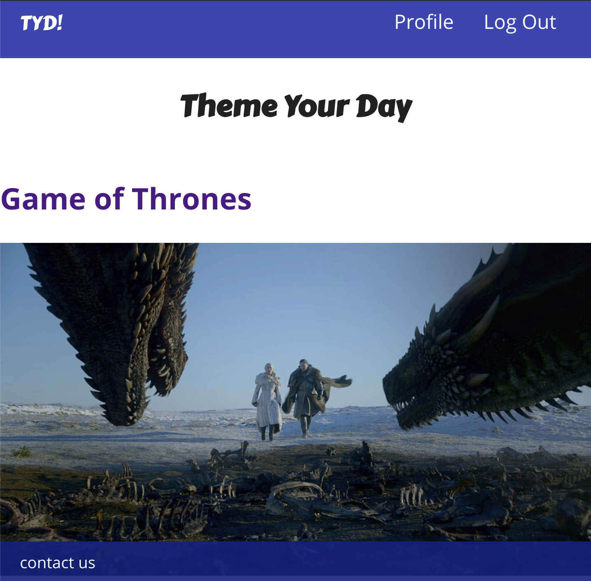
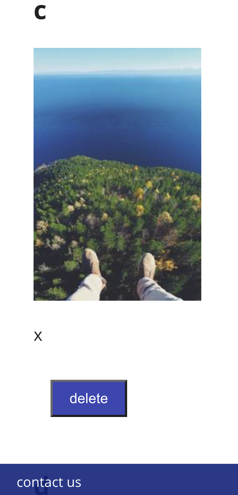
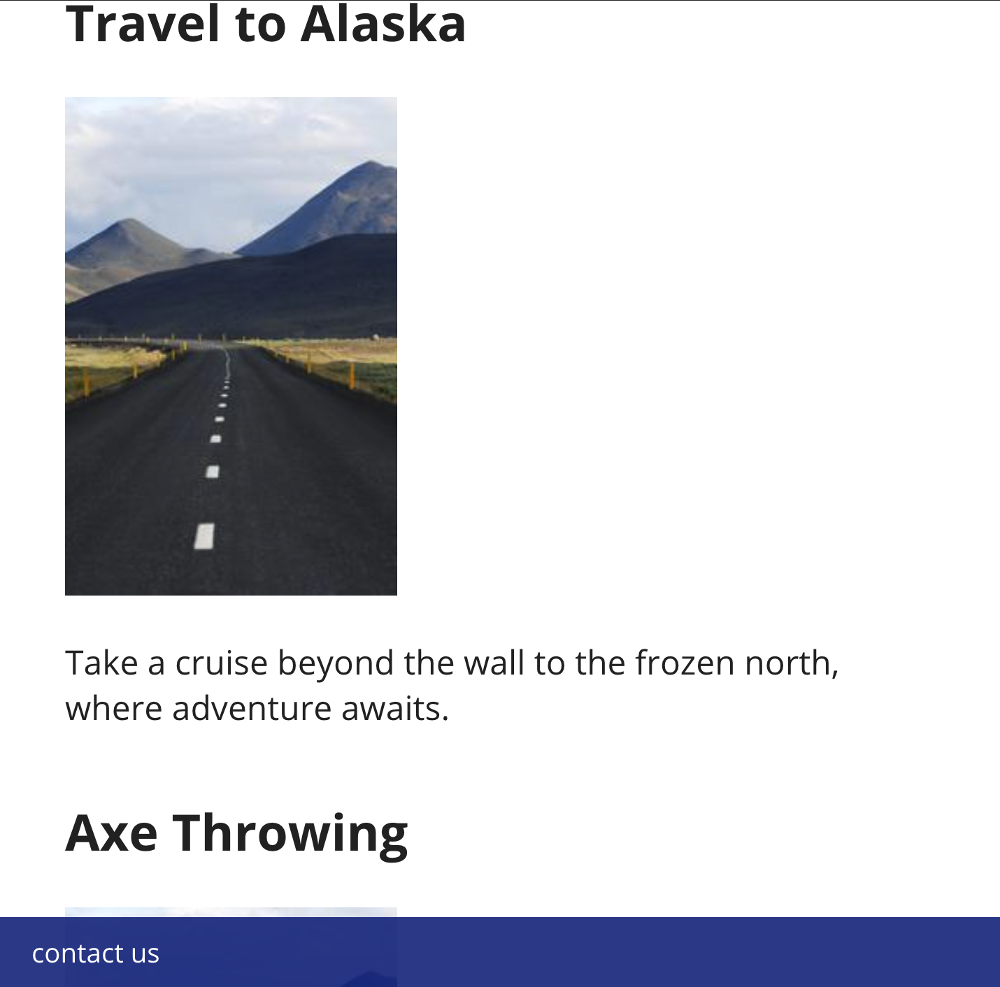

# Theme Your Day

Theme Your Day is a chance to plan activities based on your favorite shows and movies. Users can browse themes, look at their associated activities, and (if signed in) favorite them. People who are logged in can view their favorite activities, create new ones, and delete activities from their page.

This frontend is related to https://github.com/ctavispost/theme-your-day-backend

## Technologies
- React
- Express
- Node
- Postgres/Sequelize

## Getting Started
[Project Planning](https://trello.com/b/HxbXqDVU/theme-your-day)

[Wireframes and ERD](https://www.figma.com/file/NrBF8YJnNlqX7gSvrpKyRn/Untitled?node-id=0%3A1)

## Unsolved Problems
- Many of the images are currently dummies
- In some places, pictures aren't showing up
- The styling needs work, particularly to be responsive at smaller sizes

## Future Enhancements
- Connect to outside event-planning API to gather suggestions for activities
- Expand themes
- Allow for users to submit/create themes
